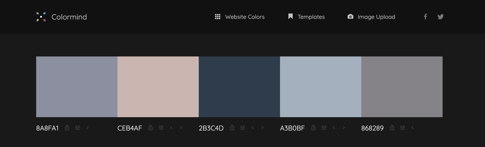

# Trade tracker

The Trade Tracker site is designed to assist stock traders in monitoring their trading journey by offering a tracking system which allows to overview and control the invested amounts and profit or loss incurred during their trading. It also provides a a summary on the total amount invested, the total profit or loss made, based on which the current balance and profit/loss percent are calculated.

The site's target audience would be anyone involved in stock trading. It is suitable for those, who look to maintain a record of their investments and results of the trades they made. Also those, who seeks to keep a trading journal and see a quick overview of their current investment portfolio. 

The site's primary goal is to help traders to keep a track of their trading progress and demonstrate a summary based on their current progress.

## Features

### Project Structure

### Design, fonts, colors

### Existing Features

####

### Features Left to Implement

## Testing

### Testing site features and behaviour

During testing, it was identified that two additional rules need to be implemented to help users accurately monitor their trading progress:

1. Users should be prevented from adding a new trade, whether positive or negative, if a investment has not been entered.

2. Users should be prevented from entering a negative amount (loss) for a new trade if this amount exceeds the 'Current balance', as in real-world scenarios, the broker would typically intervene and prevent the user from going into negative balance. Unless the user is a professional trader, however, if he is, he would be seeking for more advanced capabilities than the  current Trade Tracker can offer.

During testing, it was determined that the withdraw function falls outside the scope of the current project. Implementing such a feature would be more relevant in a more complex application, where it's possible to demonstrate in detail the impact of withdrawals on the balance and other parameters. In its current form, the withdraw function seemed to negatively influence the summary table and required a deeper analysis of user actions, which exceeds the scope of the current project. To maintain focus and clarity, and to make things simple and clear, the 'Withdraw' button has been removed from the Investment form.

Action/Feature          | Expected behavior       | Status         |
|-------------------|-------------------------|----------------|
|Enter site URL: <https://katepaulauskas.github.io/trade-tracker/> | Site page loads | Pass |
|The form 'Add investment' was tested on mobile and larger devices in multiple browsers |
|Click 'Add' | 'Please fill in this field' appears in the input field | Pass |
|Enter a negative amount into the input field, click 'Add' | 'Enter a positive amount!' alert appears on the screen | Pass |
|Enter a positive amount into the input field, click 'Add' | 'Total investment' and 'Current balance' values are updated in the 'Summary' table, displaying the entered amount | Pass |
|The form 'Add new trade' was tested on mobile and larger devices in multiple browsers |
|Click 'Add' | Please fill in this field' appears in the 'Open date' input field | Pass |
|Fill out only the 'Open date' input field, and click 'Add' | Please fill in this field' appears in the 'Close date' input field | Pass |
|Fill out the 'Open date' and 'Close date' fields only, and click 'Add' | Please fill in this field' appears in the 'Stock name' input field| Pass |
|Fill out the 'Open date', 'Close date' and 'Stock name' fields only, and click 'Add' | Please fill in this field' appears in the 'Profit/loss amount' input field | Pass |
|Fill out the 'Open date', 'Close date', 'Stock name' and 'Profit/loss amount' fields only, and click 'Add' | Please fill in this field' appears in the 'Comments' input field | Pass |
|Fill out all input fields: 'Open date', 'Close date', 'Stock name', 'Profit/loss amount' (use positive amount) and 'Comments', click 'Add' | If the investment was not entered in the 'Add investment' form, the alert appears on the screen: 'First enter investment! Cannot add trades without having an investment to trade!' | Pass
|Fill out all input fields: 'Open date', 'Close date', 'Stock name', 'Profit/loss amount' (use negative amount) and 'Comments', click 'Add' | If the investment was not entered in the 'Add investment' form, the alert appears on the screen: 'First enter investment! Cannot add trades without having an investment to trade!' | Pass
|Fill out all input fields: 'Open date', 'Close date', 'Stock name', 'Profit/loss amount' (use positive amount) and 'Comments', click 'Add' | If the investment was entered in the 'Add investment' form, 3 values are calculated and updated in the 'Summary' table: 'Current balance' 'Total profit/loss', '% profit/loss' | Pass |
|Fill out all input fields: 'Open date', 'Close date', 'Stock name', 'Profit/loss amount' (use negative amount) and 'Comments', click 'Add' | If the investment was entered in the 'Add investment' form, and the negative/loss amount of the trade exceeds the 'Current balance' amount, the following alert appears: 'The loss amount cannot exceed the Current balance, please check your entry!' | Pass |
|Fill out all input fields: 'Open date', 'Close date', 'Stock name', 'Profit/loss amount' (use negative amount) and 'Comments', click 'Add' | If the investment was entered in the 'Add investment' form, and the negative/loss amount of the trade does not exceed the 'Current balance', the amount is deducted from the 'Current balance' field, 'Total investment'and '% profit/loss' are recalculated and updated accordingly | Pass |

### Validator Testing

#### HTML

In an attempt to adhere to web standards and accessibility, the site was submitted to [W3C validation testing](<https://validator.w3.org/nu/?doc=https%3A%2F%2Fkatepaulauskas.github.io%2Ftrade-tracker%2F>). No errors were identified. However, there were 18 warnings about trailing slash on void elements, which were fixed by removing the trailing slash and extra space.

#### CSS

To align with web standards and ensure accessability compliance CSS code of the site was submitted to [(Jigsaw) validator](https://jigsaw.w3.org/css-validator/validator?uri=https%3A%2F%2Fkatepaulauskas.github.io%2Faerial-photography%2F&profile=css3svg&usermedium=all&warning=1&vextwarning=&lang=en). One error was identified, as described below.

- __Error 1:__ [Parse Error](media/css-validation-error.jpeg)
  - Correction: The missing cirly bracket was added at the end of the media query for tablets and larger screens.

#### JavaScript

In an attempt to adhere to web standards and accessibility, the JavaScript code was submitted to [JSHint Validator](<https://jshint.com/>). No errors were identified in the JavaScript code.

### Accessibility

#### Site Colors Accessibility

### Solved Bugs

## Deployment

- The current project was deployed to GutHub pages through the following deployment steps:
    1. I navigated to the settings tab in the GitHub repository.
    2. In the Code and automation section on the left-hand sidebar, I selected Pages.
       - I set Source to 'Deploy from a branch'.
       - Selected main branch in the dropdown.
       - Set the folder to / (root).
       - Clicked Save.
    3. I went back to the Code tab. Waited a few minutes and refreshed my repository.
    4. After that on the right-hand side, I located the Deployments section and clicked on 'github-pages'.
    5. I clicked on the square with an arrow pointing to the upper right corner against the last deployment on the right and was able to see my project live.

    The live link to the site can be found at the following URL: [Trade Tracker](https://katepaulauskas.github.io/trade-tracker/)

## Credits

### Content

- [Balsamiq Studios software](https://balsamiq.com/wireframes/) was used to create mockup wireframe for the current project.
- To select the fonts for the site, a font pairing service was used: [Font Joy](https://fontjoy.com/).
- Paired font families were downloaded from [Google Fonts](https://fonts.google.com/).
- Site colors accessibility was checked using [Adobe Color Accessibility Tool](<https://color.adobe.com/>).
- Icon displayed on the Home page was taken from [Iconify](https://iconify.design).
- The instructions on the usage of the 'button' type on buttons to prevent submissions and set custom functionality were taken from the following source: [MDN Web Docs](https://developer.mozilla.org/en-US/docs/Web/HTML/Element/input/button).
- To ensure forms validation the Constraint validation was achieved using the Constraint Validation API described in the folloeing source:[MDN Web Docs](https://developer.mozilla.org/en-US/docs/Web/HTML/Constraint_validation#constraint_validation_process).
- The instructions on how to work with the local storage were taken from the following source: [freeCodeCamp](https://www.freecodecamp.org/news/web-storage-localstorage-vs-sessionstorage-in-javascript/).

