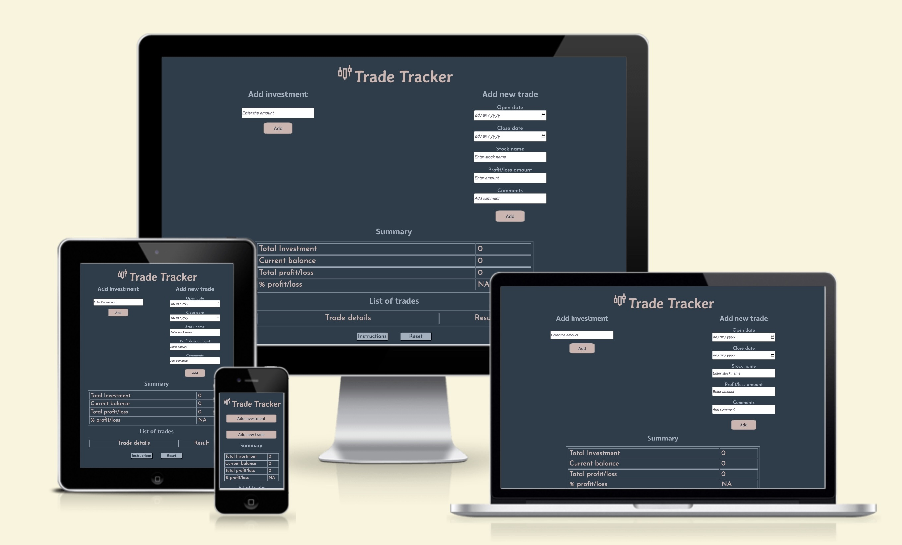
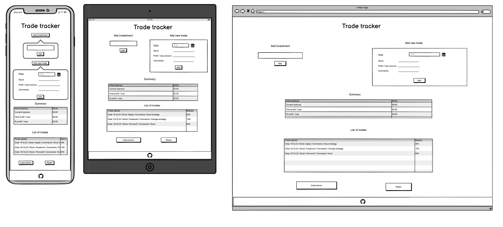
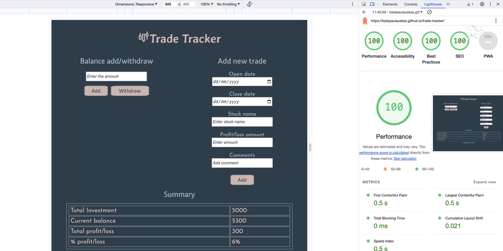
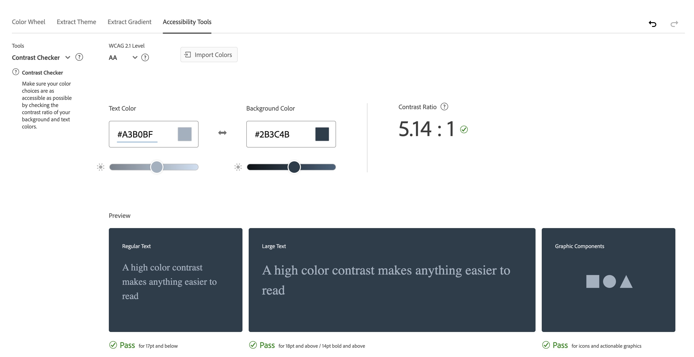
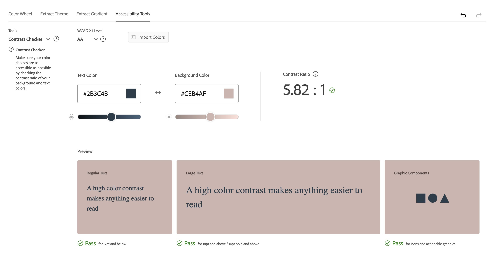

# Trade Tracker

The Trade Tracker site is designed to assist stock traders in monitoring their trading journey by offering a tracking system which allows to overview and control the invested amounts and profit or loss incurred during their trading. It also provides a a summary on the total amount invested, the total profit or loss made, based on which the current balance and profit/loss percent are calculated. Additionaly, a list of performed trades cab be viewed and analised.

The site's target audience would be anyone involved in stock trading. It is suitable for those, who look to maintain a record of their investments and results of the trades they made. Also those, who seeks to keep a trading journal and see a quick overview of their current investment portfolio and actions taken.

The site's primary goal is to help traders to keep a track of their trading progress and demonstrate a summary based on their current progress, based on which trading strategy could be analised, succesfull actions identtified and further adjustments in the tradign stategy determined, if needed.




### Design

#### Project Wireframe

The layout of the Trade Tracker application was initially developed using Balsamiq Studios software, through which a mockup wireframe was created for the current project:



#### Color Palette

The colors for Trade tracker were carefully selected using [Colormind tool](http://colormind.io/) to create a balanced, sophisticated palette that is both professional and user-friendly. The blend of warm and cool tones, along with the varying intensities of color, makes the site look modern, trustworthy, and accessible, creating the feeling of confidence and comfort.


- **#2B3C4D:** This color was chosen for the site background and buttons text. It is a deep, dark blue, almost navy color, very strong and authoritative, associated with expertise and stability. It helps to establish the site as a serious and professional tool for trading.

- **#CEB4AF:** This color is the second main color and is used for the main heading, buttons' background, and text in the summary table. This color is a soft, warm beige. It adds a touch of elegance and warmth, balancing the cooler tones of the palette. It helps to make the site feel more welcoming, especially to users new to trading.

- **#A3B0BF:** This color is used for H2, H3, and paragraph colors. It adds a sense of calm and approachability to the website.

- **#535361 & #8A8FA1:** The remaining two colors are used for smaller elements on the site, for instance, label text color on the forms, table design, buttons' background on hover, etc., and help to add the final touch to the entire palette and ensure the site looks professional, reliable, accessible, and welcoming.

#### Fonts

The fonts for the site were selected using font pairing service [Font Joy](https://fontjoy.com/). The chosen fonts are aimed at making Trading Tracker site appear both professional and user-friendly. The combination of Averia Gruesa Libre's approachability, Expletus Sans's creativity, and Josefin Sans's readability helps to create a balanced and engaging visual appearance of the site. 


 - **Averia Gruesa Libre** is a bold and slightly playful font. Its uniqueness lies in it's hand-drawn style, which adds a personal and friendly  touch to the Trade Tracker site. Using it for the H1 heading ensures that it stands out and grabs attention, making the site feel more welcoming.

- **Expletus Sans** is a decorative and playful font. It has a unique character, with a lively and approachable appearance. This font was chosen for H2 and H3 headings to maintain readability while adding a touch of personality. 

- **Josefin Sans** is a clean, simple and elegant font. It is straightforward and classy, making it a great choice for paragraph text where readability is key. Its simplicity complements the more decorative nature of the other two fonts, ensuring that the  site remains sharp and professional.


## Features

### Existing Features

#### Above-the-fold and Entry Area

The above-the-fold area features the 'Trade Tracker' heading at the top beside a stock icon, which functions as a logo. This heading is centrally placed, making it prominent and captivating. It's displayed in beige color set against a dark blue backdrop:


Below the heading, the entry area is positioned. It has a slightly different appearance on mobile devices compared to larger screens.

- **Mobile**

On mobile devices, when users land on the site, they are greeted with the heading, followed by two vertically aligned buttons: 'Add Investment' and 'Add New Trade' These buttons feature a beige background with text in dark-blue, creating a consistent and contrasting look.


Clicking on either button expands additional collapsible sections for adding investments or logging trades. Each section has an 'Add' button. These collapsible areas retract upon pressing on each of the buttons once more.


- **Larger Screens**

On larger screens, collapsible sections are unnecessary due to the ample screen space, therefore the entry area is fully displayed. The buttons are replaced by headings, and entry fields placed underneath each heading, creating two forms: 'Add Investment' and 'Add New Trade'. For efficient space utilisation, the 'Add Investment' and 'Add New Trade' forms are positioned side by side. The 'Add Investment' form is on the left, intuitively guiding users to start there as they typically read from left to right.


##### Add Investment

The 'Add Investment' form enables the user to top up their investment at any time:


It prevents the user from submitting an empty form: 


The user can only add a positive number for the investment:


 And is a requirement before starting to add trades:


##### Add New Trade

The 'Add New Trade' form has 5 fields:

- Open date
- Close date
- Stock Name
- Profit/Loss amount: This can be a positive or negative amount, with a "-" sign if the user incurred a loss during the trade.
- Comments: This field allows the user to make notes about the strategy used, emotions experienced during the trade, etc., which could help in analysing their trading strategy in the future. 


Each of the fields is required in the form and the form cannot be submitted without filling them in:


In addition, the user is not able to enter a loss that exceeds current balance, as typically broker would intervene and prevent the user from going into negative balance:


#### Summary Table

Directly beneath the entry area, a 'Summary' table is displayed. It offers a quick overview of the user's trading journal, highlighting progress and current standing. The table shows:
 - The 'Total Investment' amount made.
 - The 'Current Balance' summarizes the investments and trades made.
 - 'Total profit/loss' amount rovides a summary of earnings or losses from all trades
 - The last line presents the '% Profit/Loss,' offering a convenient way to view results at a glance.


#### List of Trades Table

The list of trades is positioned below the 'Summary' table and displays data on all the trades entered. This allows the user to review past trades and analyse them using the comments, stock names, dates and results of each trade.


#### Settings Section

Towards the bottom of the page, there are two buttons. One of them provides instructions on how to use the Trade Tracker, which can be helpful for new users or those who are unsure about how to use the application effectively. 

The second button offers a reset option. By clicking on this, all data is erased, allowing the user to start from scratch.


A popup with instructions appears when clicking on the button 'Instructions' and can be closed by clicking on the button 'Close':


#### Footer

At the bottom of the page, a footer is positioned, containing a link to the GitHub URL of the current project.


### Features Left to Implement

The following features could be implemented to further advance the Trade Tracker functionality and improve user experience:

1. Initially it was planned to create a chart showing progress over time and displaying it under the 'Summary' table. However, due to time constraints and the complexity of the setup, it was decided to move it under future features and replace it with a table of entered trades.
2. Display a log of investments along with their respective dates.
3. Add an option to withdraw from the current balance.
4. Display negative numbers in a different color (red) for clarity.
5. Show alerts when the % profit/loss is negative. Offer suggestions to change or improve the trading strategy, and recommend articles and educational videos on strategy improvement.
6. Offer data storage on the backend. Add a login bar for the members' area, allowing the Trade Tracker to be accessed through any browser. Users can log into their accounts and access their records.
7. Provide a dropdown menu for users to choose their preferred currency for display, ensuring that values are shown in a monetary format rather than as plain numbers.


## Testing

### Testing site features and behaviour

During testing, it was identified that two additional rules need to be implemented to help users accurately monitor their trading progress:

1. Users should be prevented from adding a new trade, whether positive or negative, if a investment has not been entered.

2. Users should be prevented from entering a negative amount (loss) for a new trade if this amount exceeds the 'Current balance', as in real-world scenarios, the broker would typically intervene and prevent the user from going into negative balance. Unless the user is a professional trader, however, if he is, he would be seeking for more advanced capabilities than the  current Trade Tracker can offer.

During testing, it was determined that the withdraw function falls outside the scope of the current project. Implementing such a feature would be more relevant in a more complex application, where it's possible to demonstrate in detail the impact of withdrawals on the balance and other parameters. In its current form, the withdraw function seemed to negatively influence the summary table and required a deeper analysis of user actions, which exceeds the scope of the current project. To maintain focus and clarity, and to make things simple and clear, the 'Withdraw' button has been removed from the Investment form.

Action/Feature          | Expected behavior       | Status         |
|-------------------|-------------------------|----------------|
|Enter site URL: <https://katepaulauskas.github.io/trade-tracker/> | Site page loads | Pass |
|The form 'Add investment' was tested on mobile and larger devices in multiple browsers |
|Click 'Add' | 'Please fill in this field' appears in the input field | Pass |
|Enter a negative amount into the input field, click 'Add' | 'Enter a positive amount!' alert appears on the screen | Pass |
|Enter a positive amount into the input field, click 'Add' | 'Total investment' and 'Current balance' values are updated in the 'Summary' table, displaying the entered amount | Pass |
|The form 'Add new trade' was tested on mobile and larger devices in multiple browsers |
|Click 'Add' | Please fill in this field' appears in the 'Open date' input field | Pass |
|Fill out only the 'Open date' input field, and click 'Add' | Please fill in this field' appears in the 'Close date' input field | Pass |
|Fill out the 'Open date' and 'Close date' fields only, and click 'Add' | Please fill in this field' appears in the 'Stock name' input field| Pass |
|Fill out the 'Open date', 'Close date' and 'Stock name' fields only, and click 'Add' | Please fill in this field' appears in the 'Profit/loss amount' input field | Pass |
|Fill out the 'Open date', 'Close date', 'Stock name' and 'Profit/loss amount' fields only, and click 'Add' | Please fill in this field' appears in the 'Comments' input field | Pass |
|Fill out all input fields: 'Open date', 'Close date', 'Stock name', 'Profit/loss amount' (use positive amount) and 'Comments', click 'Add' | If the investment was not entered in the 'Add investment' form, the alert appears on the screen: 'First enter investment! Cannot add trades without having an investment to trade!' | Pass
|Fill out all input fields: 'Open date', 'Close date', 'Stock name', 'Profit/loss amount' (use negative amount) and 'Comments', click 'Add' | If the investment was not entered in the 'Add investment' form, the alert appears on the screen: 'First enter investment! Cannot add trades without having an investment to trade!' | Pass
|Fill out all input fields: 'Open date', 'Close date', 'Stock name', 'Profit/loss amount' (use positive amount) and 'Comments', click 'Add' | If the investment was entered in the 'Add investment' form, 3 values are calculated and updated in the 'Summary' table: 'Current balance' 'Total profit/loss', '% profit/loss'. Trade ditails are displayed in the 'List of trades' table | Pass |
|Fill out all input fields: 'Open date', 'Close date', 'Stock name', 'Profit/loss amount' (use negative amount) and 'Comments', click 'Add' | If the investment was entered in the 'Add investment' form, and the negative/loss amount of the trade exceeds the 'Current balance' amount, the following alert appears: 'The loss amount cannot exceed the Current balance, please check your entry!' | Pass |
|Fill out all input fields: 'Open date', 'Close date', 'Stock name', 'Profit/loss amount' (use negative amount) and 'Comments', click 'Add' | If the investment was entered in the 'Add investment' form, and the negative/loss amount of the trade does not exceed the 'Current balance', the amount is deducted from the 'Current balance' field, 'Total investment'and '% profit/loss' are recalculated and updated accordingly. Trade ditails are displayed in the 'List of trades' table | Pass |
|Add second trade by filling in all input fields: in the  'Add new trade' form: 'Open date', 'Close date', 'Stock name', 'Profit/loss amount' (use positive amount) and 'Comments', click 'Add' | Three values are updated in the 'Summary' table: 'Current balance' 'Total profit/loss', '% profit/loss'. Trade ditails are displayed in the 'List of trades' table below the previouse trade entry | Pass |
|The tables 'Summary' and 'List of trades' was tested on mobile and larger devices in multiple browsers |
|Reload the page after the investment amount has been entered through the 'Add investment' form | 'Total investment' and 'Current balance' values are displayed in the 'Summary' table, as they have been stored in the local storage and displayed after the reload | Pass | 
|Reload the page after the investment amount has been entered through the 'Add investment' form and at least one trade was added through the  'Add new trade' form | All four values are displayed in the Summary table: 'Total investment', 'Current balance', 'Total profit/loss', and '% profit/loss'. Trade ditails are displayed in the 'List of trades' table. This means all data have been stored in the local storage and displayed after the reload | Pass | 
|Settings section was tested on mobile and larger devices in multiple browsers|
|Click on the button 'Instructions' | Popup with instructions on how to use Trade Tracker appears on the screen | Pass |
|Click on the 'Close' button on the popup with the instructions | Popup disappears | Pass |
|Click on the 'Reset' button | All the entries are erased, application is ready to be used from scratch | Pass |
| Footer link was tested on mobile and larger devices in multiple browsers |	
| Click on the GitHub icon in the footer |	External link leading to GitHub page opens in a new page |	Pass |


### Validator Testing

#### HTML

In an attempt to adhere to web standards and accessibility, the site was submitted to [W3C validation testing](<https://validator.w3.org/nu/?doc=https%3A%2F%2Fkatepaulauskas.github.io%2Ftrade-tracker%2F>). No errors were identified. However, there were 18 warnings about trailing slash on void elements, which were fixed by removing the trailing slash and extra space.

#### CSS

To align with web standards and ensure accessability compliance CSS code of the site was submitted to [(Jigsaw) validator](https://jigsaw.w3.org/css-validator/validator?uri=https%3A%2F%2Fkatepaulauskas.github.io%2Faerial-photography%2F&profile=css3svg&usermedium=all&warning=1&vextwarning=&lang=en). One error was identified, as described below.

- __Error 1:__ [Parse Error](media/css-validation-error.jpeg)
  - Correction: The missing curly bracket was added at the end of the media query for tablets and larger screens.

#### JavaScript

In an attempt to adhere to web standards and accessibility, the JavaScript code was submitted to [JSHint Validator](<https://jshint.com/>). No errors were identified in the JavaScript code.


### Accessibility

To ensure the accessibility requirements are met for the current project, the Lighthouse testing was done for mobile and desktop versions of the site.

- Mobile

Initially, the test returned the score of 91 for Accessibility on mobile. Performance was indicated at 99, and the rest of indicators: Best Practices and SEO got the score of 100. 


In attempt to improve the Accessibility score on mobile the background color of the buttons to open 'Investment' and 'New Trade' sections was changed to improve the contrast between the text on the buttons and their colors. 

As a result, Accessibility was improved and resulted in a score of 100: 


 on mobile, to increase contrast and improve accessibility.


- Desktop

The Lighthouse test also indicated issues with the Accessibility score on desktop displaying it at 89. With the rest of the indicators being at 100:


In an attempt to improve the Accessibility score on desktop, a darker shade was chosen to display labels on the forms' input fields.

 Also, the order of headings in the HTML file was improved. 

As a result, Accessibility on desktop was improved and resulted in the score of 100:




#### Site Colors Accessibility

The color palette for the site was selected using [Colormind tool](http://colormind.io/):


However, after running the test to check the site text and icon colors against their backgrounds for contrast using the [Adoby Color Contrast Checker](https://color.adobe.com/create/color-contrast-analyzer), an issue was identified with one of the colors: 


Therefore a darker shade was chosen and the color #868289, which was used was used to display labels on the site's forms, was replaced with #535361:


The rest of the tests on the contrast between text colors against their backgrounds with the [Adoby Color Contrast Checker](https://color.adobe.com/create/color-contrast-analyzer) returned positive results.

Beige color on dark-blue background:


Light-blue color on dark-blue background:



Dark-blue color on beige background:



The site colors were also checked for accessibility to ensure they are color-blind safe using the [Adoby Color accessibility tool](https://color.adobe.com/create/color-accessibility), which returned the following result :'No conflicts found. Swatches are color blind safe':


### Solved Bugs

1. When working with the 'Add Investment' and 'Add New Trade' entry forms, the buttons' type was changed from 'submit' to 'button' as form submission wasn't necessary, and the 'button' type seemed more suitable for locally storing data entered in the forms. However, it was later discovered that this change disabled the forms' validation functionality. Further research into the topic revealed that constraint validation could still be achieved using the Constraint Validation API, as described in the following source: [MDN Web Docs](https://developer.mozilla.org/en-US/docs/Web/HTML/Constraint_validation#constraint_validation_process), which provided guidance on resolving the issue.

2. The current project required the use of local storage and implementation of JSON functions, which were beyond of my scope. However, the inspiration drawn from the project idea led to further research on this topic. While working with local storage and JSON functions, two key sources were instrumental in bridging knowledge gaps on this previously out-of-scope topics: [freeCodeCamp](https://www.freecodecamp.org/news/web-storage-localstorage-vs-sessionstorage-in-javascript/) and [LogRocket Frontend Analytics](https://blog.logrocket.com/localstorage-javascript-complete-guide/).

3. An event listener was added twice to the 'Add' button in the 'Add Trades' form to store tades data in local storage and to performing calculations for the 'Summary' table. In both cases, form validation was required and was set using Constraint Validation API. During testing, it was noticed that validation was no longer displaid on the form in Safari browser. It was decided to combine two event listeners added to the 'Add' button in the 'Add Trades' form in attempt to resolve form validation conflict in Safari browser, which was successful.

 __Before:__

 - Event listener No 1

```   
// Add an event listener to the 'Add' button in the 'Add Trades' form to perform calculations for 'Summary' table

document.getElementById("add-trade-button").addEventListener("click", function() {
	calculateTotalProfitLossAmount();
});
```

 - Event listener No 2

```// Add an event listener to the 'Submit' button in the 'Add Trades' section to store form submission data in local storage
document.getElementById("add-trade-button").addEventListener("click", function() {

	// Check if the form is valid
	if (document.getElementById("add-trade").checkValidity()) {

		// Create an object to store trade details in local storage
		let tradeData = {
			openDate: document.getElementById("open-date").value,
			closeDate: document.getElementById("close-date").value,
			stockName: document.getElementById("stock").value,
			result: document.getElementById("result").value,
			comments: document.getElementById("comments").value,
		};

		// Store trades data only if the investment amount was entered 
		if (isInvestmentEntered()) {
			storeTrade(tradeData);
		}
		displayTrades();
		// Clear the form once tade data stored 
		clearAddTradeForm();

	} else {

		//Form is not valid, show an error message
		document.getElementById("add-trade").reportValidity();
	}
});
```

__After:__

```// Add event listener to the 'Add' button in the 'Add Trades' form to store tades data in local storage and perform calculations for the 'Summary' table
document.getElementById("add-trade-button").addEventListener("click", function() {

    // Check if the form is valid
    if (document.getElementById("add-trade").checkValidity()) {

        // If form is valid, first handle the trade data storage
        handleTradeDataStorage();

        // Then perform the calculation for the 'Summary' table
        calculateTotalProfitLossAmount();
    } else {

        // If form is not valid, trigger error messages
        document.getElementById("add-trade").reportValidity();
    }
});
```

### Unsolved Bugs

At present, to access the collapsible sections for making entries on mobile devices upon initial load, the buttons need to be clicked twice. Subsequent buttons respond with a single touch. However, after reloading the page, this behavior repeats itself. This occurs on both iOS and Android devices. In an attempt to resolve this and achieve buttons' response with a single click on initial load, various touch events were tested when adding event listeners to the buttons: 'click,' 'touchstart,' and 'touchend,' following instructions from [MDN Web Docs](https://developer.mozilla.org/en-US/docs/Web/API/Touch_events/Using_Touch_Events). Unfortunately, this did not alter the behavior, and the bug remains unresolved.

## Deployment

- The current project was deployed to GitHub Pages through the following deployment steps:
    1. I navigated to the settings tab in the GitHub repository.
    2. In the Code and automation section on the left-hand sidebar, I selected Pages.
       - I set Source to 'Deploy from a branch'.
       - Selected main branch in the dropdown.
       - Set the folder to / (root).
       - Clicked Save.
    3. I went back to the Code tab. Waited a few minutes and refreshed my repository.
    4. After that on the right-hand side, I located the Deployments section and clicked on 'github-pages'.
    5. I clicked on the square with an arrow pointing to the upper right corner against the last deployment on the right and was able to see my project live.

    The live link to the site can be found at the following URL: [Trade Tracker](https://katepaulauskas.github.io/trade-tracker/)

## Credits

### Content

- [Balsamiq Studios software](https://balsamiq.com/wireframes/) was used to create mockup wireframe for the current project.
- To select the fonts for the site, a font pairing service was used: [Font Joy](https://fontjoy.com/).
- The color palette for the site was selected using [Colormind tool](http://colormind.io/):
- Paired font families were downloaded from [Google Fonts](https://fonts.google.com/).
- Site colors accessibility was checked using [Adobe Color Accessibility Tool](https://color.adobe.com/).
- The instructions on the usage of the 'button' type on buttons to prevent submissions and set custom functionality were taken from the following source: [MDN Web Docs](https://developer.mozilla.org/en-US/docs/Web/HTML/Element/input/button).
- To ensure forms validation the Constraint validation was achieved using the Constraint Validation API described in the following source:[MDN Web Docs](https://developer.mozilla.org/en-US/docs/Web/HTML/Constraint_validation#constraint_validation_process).
- Instructions on how to work with the local storage were taken from the following source: [freeCodeCamp](https://www.freecodecamp.org/news/web-storage-localstorage-vs-sessionstorage-in-javascript/).
- When writing the code to store trade details as objects and ensuring the data is stored as arrays and does not get overwritten, the following guide was used [LogRocket Frontend Analytics](https://blog.logrocket.com/localstorage-javascript-complete-guide/)
- To write the function to clear the 'Add new trade' form after a new trade is stored to the local storage the following source was used [MDN Web Docs](https://developer.mozilla.org/en-US/docs/Web/API/HTMLFormElement/reset).
- To clear 'List of trades' table data, but to keep headings, when writing the function to reset the application, the following instructions from [MDN Web Docs](https://developer.mozilla.org/en-US/docs/Web/API/Document/querySelectorAll) were used to target all table cells with trades' entered data.
- When working on the bug with buttons that trigger collapsible sections to open, instructions from [MDN Web Docs](https://developer.mozilla.org/en-US/docs/Web/API/Touch_events/Using_Touch_Events) were used.

### Media
- Icon displayed on the Home page was taken from [Iconify](https://iconify.design).